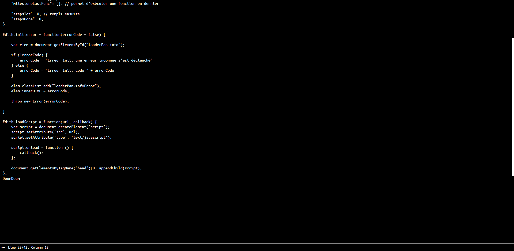

# Documentation Edith

Les pages suivantes documentent le fonctionnement d'Edith


## Présentation

* [Présentation Générale](#présentation-générale)
* [Utilisation](#utilisation)
* [Keybinding (raccourcis clavier)](#keybinding)

## Customisation


## Autre


---

## Présentation Générale

Edith est un éditeur de texte web, il permet d’écrire du code, de l’exécuter, et de le sauvegarder.

L'éditeur possède plusieurs moyens de personnalisation, dont les raccourcis, ainsi que de nombreux paramètres sur lesquels agir

L'application se présente sous la forme suivante: 



1. L'Éditeur, c'est ici que l'on peut écrire tout ce dont on a besoin
2. La console, ici se retrouve ce que renvoi le programme exécuté
3. La barre de statut, on y retrouve quelques éléments :
	1. Un bouton qui ouvre le menu
	2. Des info sur l’éditeur (le nombre de lignes, de colonnes ..)
	3. invisible sur le moment, mais un emplacement pour afficher ce que fait Edith


## Utilisation

Edith se contrôle principalement avec le clavier, en réalité toutes les actions peuvent être déclenché simplement au clavier

Pour cela, de nombreux raccourcis clavier (keybinding) sont utilisés (voir la [liste complète](#keybind))

---

## Customisation

### Keybind

Tout les raccourcis clavier se trouvent configuré dans les [settings](#settings)

Les raccourcis peuvent être changé, ajouté ou supprimé

La partie keybind des settings ressemble a ceci

``` 
"keyBind": [
	{"keys": "arrowup", "command": {"opcode": "handleMenu", "arg": {"action": "movePointer", "direction": "up"}}, "prevDefault": true, "context": [
		{"type": "focus", "focused": "menu"}
	]},

	{"keys": "alt+p", "command": {"opcode": "openWin", "arg": {"win": "menu", "arg": {"resetPath": true}}}, "prevDefault": true},
	{"keys": "escape", "command": {"opcode": "closeWin"}, "prevDefault": true}
]
```

On y vois que keyBind est un array (le fichier de config étant au format JSON5).
Et chaque éléments est un objet, contenant :

1. "`keys`" (requis): qui donne la combinaison de touche du raccourci
2. "`command`" (requis): qui donne la commande a exécuter lorsque le raccourci est utilisé (voir [commandes](#commandes) pour plus d'info)
3. "`prevDefault`" (opt): permet d’empêcher le comportement par défaut du navigateur lors de l'utilisation du raccourcis
4. "`context`" (opt): permet de ne déclencher le raccourci que lorsque des conditions sont réunies (voir [Keybind Context](#keybind-context) pour plus d'info)


#### Exemple

```
{"keys": "alt+p", "command": {"opcode": "openWin", "arg": {"win": "menu", "arg": {"resetPath": true}}}, "prevDefault": true},
```

La ligne ci-dessus défini un raccourci déclenché par `alt+p` qui ouvre un fenêtre (`openWin`) nommé `menu`, avec un l'argument resetPath, tout en demandant d’empêcher le comportement par défaut qui peut être d'imprimer la page par exemple


#### Touche de combinaison

La plupart des raccourcis sont composé de touches de combinaison (ou modificatrice) (ctrl, alt ...) et d'une touche normale

Les touches modificatrice sont :

`ctrl`<br>
`alt`<br>
`shift`<br>


#### Touches normales

Les touches normales sont assez représentatives

pour les lettre se sont simplement `a`, `b`, `c` ..

Les chiffres sont noté de la même manière, `1`, `2` ..

Pour la plupart de touches, ce sont leur nom commun, directement marqué sur le clavier par exemple

Pour les touches spéciales (flèche haute, entré, espace ..), elles ont toutes un nom :

`enter`, `backspace`, `insert`, `home` ...

Les nom de toutes ces touches sont notées sur le site [http://keycode.info/](http://keycode.info/), il faut regarder "event.key"

**Attention**, toutes les combinaisons de touche, doivent être écrites en minuscule (home, et non Home, arrowup et non ArrowUp ...)

#### Créer la combinaison

Pour écrire la combinaison de touche, ils y a quelques règles a suivre pour que les touches soit reconnue:

1. Chaque touches doivent être séparés par un `+` sans espace
2. les touches modificatrices doivent être dans l'ordre suivent : `ctrl`, `alt`, `shift`, par exemple : `ctrl+shift`, ou `ctrl+alt` ..
3. les nom de touches, sont tout le temps en minuscules


#### Context

Il est possible d'ajouter des conditions au déclenchement d'un raccourci

Exemple:

```
"context": [
	{"type": "focus", "focused": "menu"}
]
```

On vois que context est un array (JSON) permettant autant de conditions voulues

Chaque conditions sont des objets contenant :

- `type` qui sert a défini le type de condition, voir plus bas pour une liste
- et un ou plusieurs arguments, ici dans l'exemple `focused`

##### Liste des type de context

* focus: permet de mettre une condition sur ce qui est en focus direct sur l'écran (voir [focus](#focus) pour plus d'info)

Ici, un seul argument est nécessaire: `focused`, c'est ce sur quoi le focus doit être porté

* settings: permet de déclencher seulement si le paramètre demandé est bien a une valeur donné

Il y a besoin de deux arguments :
`setting`: qui donne le nom du paramètre
`value`: qui donne la valeur attendue


## Misc 

### Focus 

Il existe une notion de focus dans Edith, qui permet de savoir le endroit important de la page sur lequel l'utilisateur travail/porte son attention

Ce focus est déterminé grâce a un systeme de priorité : (du haut vers le bas, de la plus grand prio a la plus petite)

1. Éditeur
2. Fenêtre (donne le nom de la fenêtre en question eg menu, about ..)
3. Body

Si l'éditeur est en focus (au sens html du terme) la fonction renvoi éditeur, si il y a une fenêtre ouverte sans focus c'est le nom de la fenêtre qui est renvoyé, si ni l'un ni l'autre ne peut être renvoyé, alors c'est body